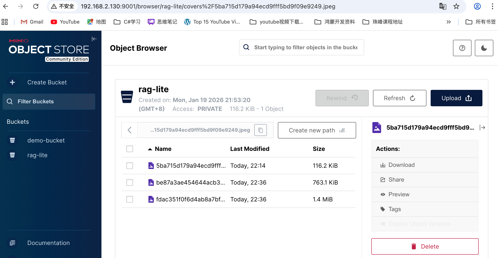
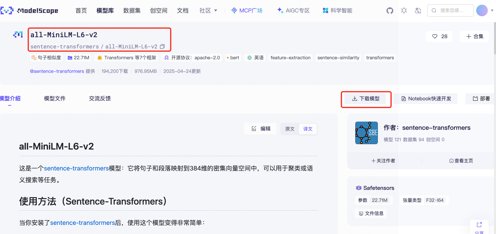

# 使用 pip 安装
pip install uv

# 或使用官方安装脚本（Linux/Mac）
curl -LsSf https://astral.sh/uv/install.sh | sh

# Windows
powershell -c "irm https://astral.sh/uv/install.ps1 | iex"

# 安装mysql


# 通过uv安装项目依赖
```
uv add flask flask_cors  sqlalchemy python-dotenv langchain langchain-community langchain-openai langchain-chroma langchain-huggingface  langchain-deepseek pymysql minio langchain_milvus docx2txt pypdf sentence-transformers
```

包名	                  作用简述
flask	                 轻量级Web应用框架，用于快速搭建Web服务器和API。
flask_cors	             Flask 的跨域资源共享扩展，允许前端跨域访问后端API。
sqlalchemy	             Python中强大的ORM工具，实现数据库操作对象化。
python-dotenv	         用于加载和管理环境变量，支持从.env文件读取配置信息。
langchain	             大模型相关应用的开发框架，便于构建与AI/LLM相关的工作流。
langchain-community	     Langchain的社区贡献组件包，包含各类社区支持的工具与集成。
langchain-openai	     Langchain针对OpenAI平台（如ChatGPT等）的集成和封装。
langchain-chroma	     Langchain与Chroma向量数据库的集成，用于存储和检索向量数据。
langchain-huggingface	 Langchain与Huggingface平台的集成，支持各类Huggingface模型调用。
langchain-deepseek	     Langchain与DeepSeek平台的集成，用于接入DeepSeek相关的AI模型。
pymysql	                 纯 Python 实现的 MySQL 数据库驱动，SQLAlchemy 访问 MySQL 时的必要依赖。
minio	                 支持 MinIO 分布式对象存储服务，可用于大文件和分布式存储需求。
docx2txt	             纯Python的docx文档（Word）解析库，用于提取docx文件中的文本内容。
pypdf	                 强大的Python PDF解析库，用于从PDF文件中读取、分割页面和提取文本数据。
sentence-transformers	 强大的文本向量化库，支持多种预训练模型进行文本嵌入计算。

# 安装mysql
- 阿里云开源镜像站：https://mirrors.aliyun.com/mysql/
- 网易开源镜像站：https://mirrors.163.com/mysql/Downloads/

# macos  下载minio
# 说明：macOS 终端中下载并运行 MinIO
curl -O https://dl.min.io/server/minio/release/darwin-amd64/minio
chmod +x minio
./minio server ~/minio-data --console-address ":9001"



# 用docker安装milvus
- 
- 安装attu，用于可视化管理milvus
- docker 安装好attu后，要执行以下命令启动attu，8000端口映射容器的3000端口，
- 然后在浏览器中访问http://localhost:8000 即可打开attu的可视化管理界面
docker run -p 8000:3000 -e MILVUS_URL=192.168.2.5:19530 zilliz/attu:latest

# 在摩搭社区下载以下模型到服务器
- sentence-transformers/all-MiniLM-L6-v2
- sentence-transformers/paraphrase-multilingual-MiniLM-L12-v2
- 下载好后，如果是本地部署，在服务器上面创建一个目录embeddingModels
